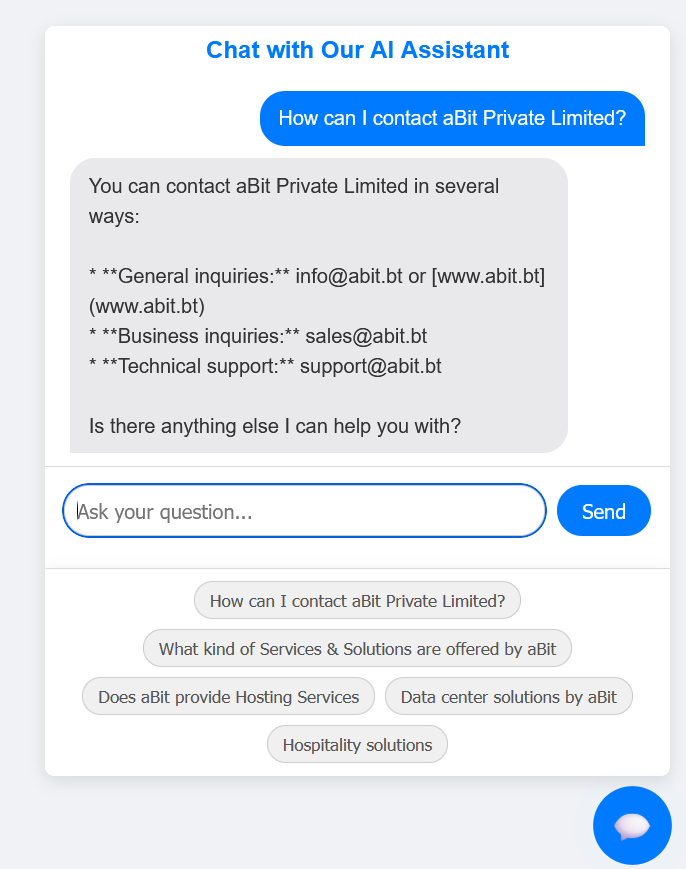
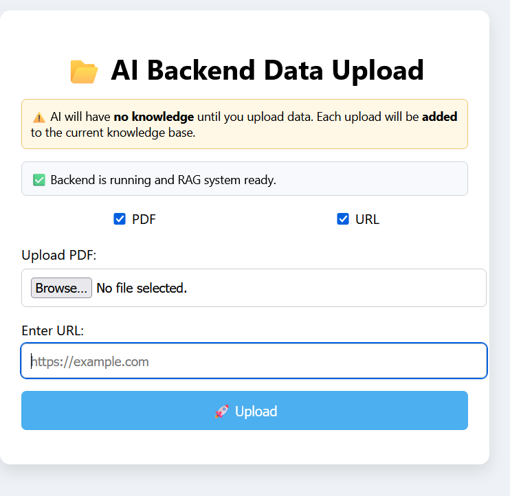

# 🌟 aBitBot: An Intelligent Knowledge Retrieval System 🌟

### A Retrieval-Augmented Generation (RAG) Project

---

### 💡 Project Overview

aBitBot is a powerful, developer-centric solution for building custom, data-grounded chatbots. Created during a summer internship, this project demonstrates a robust implementation of the **Retrieval-Augmented Generation (RAG)** framework. It tackles the fundamental challenge of Large Language Models (LLMs): a lack of specific, up-to-date knowledge and a tendency to "hallucinate" information.

This system is a full-stack application, complete with a powerful Node.js backend and a dedicated UI. The front-end provides the chat interface, while an admin panel allows for easy data management, making it a comprehensive and production-ready solution.

### 🧠 The RAG Pipeline Explained

The magic of aBitBot lies in its RAG architecture, a multi-stage process that ensures accuracy and relevance:

1.  **Data Ingestion**: The system starts by ingesting raw, unstructured data from diverse sources. We support both web crawling from provided URLs and parsing of uploaded PDF files.
2.  **Document Chunking**: Ingested documents are broken into smaller, meaningful segments using a `RecursiveCharacterTextSplitter`. This step is crucial for efficient retrieval and for fitting information within the LLM's context window.
3.  **Vector Embeddings**: Each text chunk is transformed into a dense numerical vector using the **Google Generative AI Embeddings** model. This process captures the semantic meaning of the text.
4.  **Vector Storage**: These embeddings are persisted in a **Chroma DB** instance, which acts as the project's long-term memory. It allows for lightning-fast similarity searches.
5.  **Retrieval**: When a user submits a query, the system converts it into a vector and performs a similarity search against the Chroma DB. It retrieves the most relevant text chunks from the knowledge base.
6.  **Augmented Generation**: The retrieved context, combined with the original user query, is sent to the `gemini-1.5-flash` LLM. The model is instructed to generate a response *only* using this provided information. This final step is what makes the output trustworthy and directly attributable to the source data.

### ✨ UI & Front-end

The user interface is a crucial part of the aBitBot ecosystem, offering a complete, end-to-end experience:

* **Front-end**: A clean, intuitive chat interface where users can interact with the RAG-powered chatbot.
* 
* **Admin Panel**: A dedicated administrative interface that allows for the management of the knowledge base, including the easy upload of new data (URLs and PDFs). This panel provides a seamless way to update the system's core intelligence without requiring direct interaction with the backend.
  

### 💡 Gemini API & `gemini-1.5-flash` Model

The **Google Gemini API** is the backbone of the AI functionality. The `gemini-1.5-flash` model was specifically chosen for its:

* **Speed and Efficiency**: Optimized for low-latency, high-volume tasks for a responsive chatbot experience.
* **Cost-Effectiveness**: Provides a strong balance of performance and cost.
* **Large Context Window**: Crucial for RAG, as it allows the model to process significant amounts of retrieved contextual information.

### 🛠️ Technology Stack

* **Backend**: Node.js, Express.js
* **RAG Framework**: LangChain.js
* **LLM & Embeddings**: Gemini API (`gemini-1.5-flash` and `GoogleGenerativeAIEmbeddings`)
* **Vector Database**: Chroma DB
* **Data Loaders**: `CheerioWebBaseLoader`, `PDFLoader`
* **Tools**: `multer` for file uploads, `dotenv` for environment variables

### 🛣️ Future Enhancements

* **Multiple Data Sources**: Extend the system to support additional file types (e.g., DOCX, TXT) and databases.
* **Multi-Modal RAG**: Integrate Gemini's multi-modal capabilities to handle queries related to images or other non-text data.!
